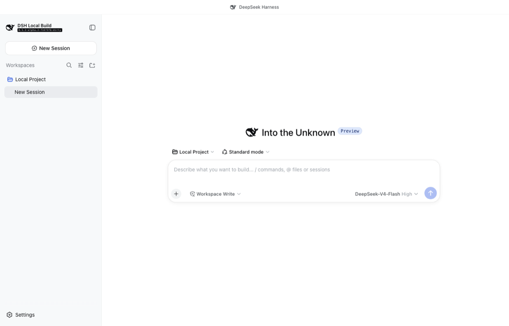
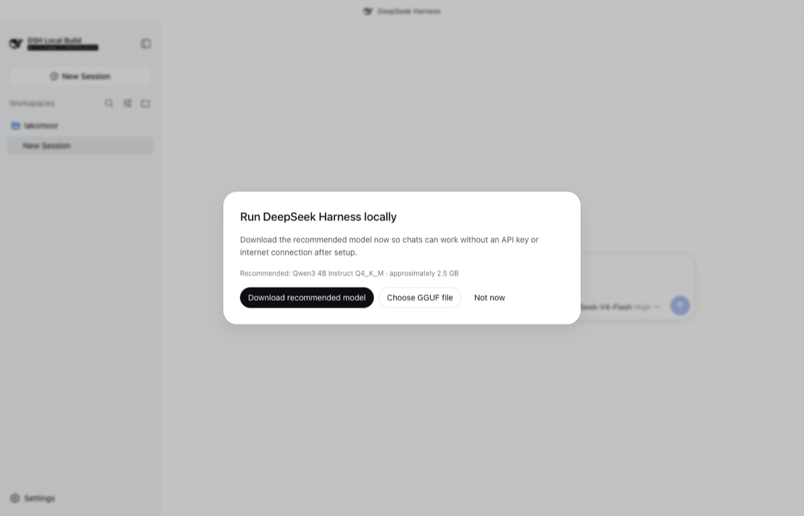
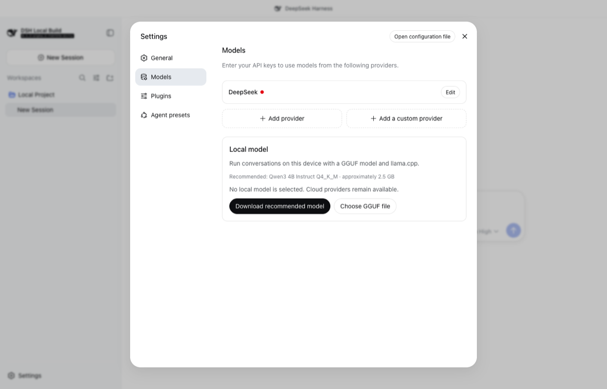

# DeepSeek Harness

[English](README.md) | 中文

DeepSeek Harness（`dsh`）是由 [DeepSeek AI](https://deepseek.com) 开发的开源 agent harness（智能体框架）。

它构建于**一切皆插件**的架构之上，由 [Cordis](https://github.com/cordiverse/cordis) 驱动，其设计参见论文 [_A Programming Paradigm for Spatiotemporal Composability_](https://arxiv.org/abs/2608.25512)。

文档：[https://deepseek-harness.github.io/deepseek-harness/](https://deepseek-harness.github.io/deepseek-harness/)

## 桌面版

由 [LakoMoor](https://github.com/LakoMoor) 维护的桌面版将 Harness 打包为可安装的 macOS、Windows 和 Linux 应用，同时保留完整的 Web UI 与插件系统。

<p align="center"></p>

### 桌面版功能

- 通过原生窗口、自定义 title bar、应用图标、托盘控制和后台 backend lifecycle 运行。
- 在首次启动设置中下载推荐的本地模型，或之后在 Settings 中选择任意兼容的 GGUF 文件。
- 模型下载期间可继续浏览应用；title bar 与 Models 设置中会持续显示进度。
- 通过 `node-llama-cpp` 运行本地对话，并按平台选择 Metal、CUDA、Vulkan 或 CPU 支持。
- 通过 GitHub Actions 为 macOS、Windows 和 Linux 构建原生 x64 与 ARM64 安装包。

<table>
  <tr>
    <td></td>
    <td></td>
  </tr>
</table>

开发、打包与发布说明参见[桌面版指南](apps/desktop/README.zh.md)。

## 开发者预览

DeepSeek Harness 处于 _开发者预览_ 阶段，正在快速迭代。**未来将出现破坏兼容性的变更。**

运行本项目前，请阅读[安全说明](SAFETY.zh.md)。

<a id="run"></a>

## 运行

### 通过 `npm` 运行

安装 `Node.js`，然后运行：

```sh
npx @deepseek-ai/dsh web
```

该命令默认会在 `http://127.0.0.1:3080` 启动 Web UI，本机启动时还会用默认浏览器打开页面。通过 SSH 启动时只打印宿主机 URL，因为本地转发地址由 SSH 客户端或编辑器持有。传入 `--no-open` 可仅运行服务器而不打开浏览器。详见 [Web UI 指南](docs/user/guide/index.zh.md)。

<a id="run-from-source"></a>

### 从源码运行

如需从仓库源码运行：

```sh
git clone https://github.com/LakoMoor/deepseek-harness.git
cd deepseek-harness
pnpm install
pnpm run build
pnpm dsh web
```

`pnpm run build` 会准备仓库产物。`pnpm dsh web` 会直接使用这些已构建产物，不会重新构建。

## 社区与支持

- 通过 [GitHub Discussions](https://github.com/deepseek-ai/deepseek-harness/discussions) 提交反馈或 bug 报告。
- 为你的插件仓库添加 [`dsh-plugin`](https://github.com/topics/dsh-plugin) 话题，便于被发现。
- 欢迎加入 DeepSeek Harness 企微群：扫码添加企微小助手并填写入群问卷，完成后小助手会邀请你入群。

<table>
  <thead>
    <tr>
      <th align="center">企微小助手</th>
      <th align="center">入群问卷</th>
      <th align="center">微信公众号</th>
    </tr>
  </thead>
  <tbody>
    <tr>
      <td align="center"></td>
      <td align="center"><a href="https://trtgsjkv6r.feishu.cn/share/base/form/shrcnIt5twSVdLGD52KJBckGCgg"></a></td>
      <td align="center"></td>
    </tr>
  </tbody>
</table>

## 参与贡献

参见 [CONTRIBUTING.md](CONTRIBUTING.zh.md)。

## 开发

请先阅读[开发指南](docs/development.zh.md)与[架构文档](docs/architecture.zh.md)。

面向 agent：请遵循 [AGENTS.md](AGENTS.md)。

## 许可证

[MIT](LICENSE)

第三方依赖及其许可证见 [THIRD_PARTY_NOTICES.md](THIRD_PARTY_NOTICES.md)。
